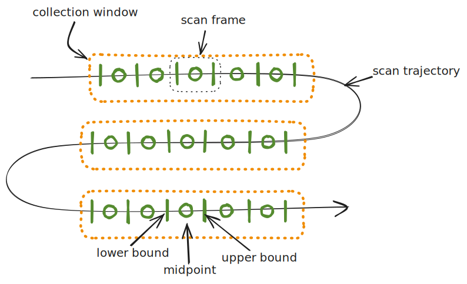

# Flyscanning

We can classify data collections across a spatial or parameterised domain into two broad categories: step scanning, and flyscanning.

* Step scanning: The system performs a sequence of discrete operations: move to the next position, settle, acquire data, repeat.
This ensures well-defined data points but may result in longer total acquisition times.
Bluesky plans specify this type of measurement through devices' [Movable](https://blueskyproject.io/bluesky/main/hardware.html#bluesky.protocols.Movable)
and [Collectable](https://blueskyproject.io/bluesky/main/hardware.html#bluesky.protocols.Collectable) protocols.

* Fly scanning: Short for "on-the-fly scanning," this method involves continuous motion during data acquisition. The motion and data collection processes
happen simultaneously, enabling faster scans and smoother coverage of the scanned domain. Devices capable of this mode implement the [Flyable](https://blueskyproject.io/bluesky/main/hardware.html#bluesky.protocols.Flyable) protocol.

## Frames and collection windows

Consider some trajectory in 2D space:

Along the flyscan trajectory we define discrete collection windows, which are intervals where a coherent block of data is acquired.
The data collection block is the frame, defined as [a vector of lower, mid and upper points in scan space](https://blueskyproject.io/scanspec/main/explanations/technical-terms.html#frame). Note that a step scan could also be understood as a flyscan where the frames' lower and upper bounds are the same as their midpoints.
Frames map directly to Bluesky [Events](https://blueskyproject.io/bluesky/main/documents.html#event), and typically corresponds to a single detector exposure, though they may be composed of multiple detector frames.

## Synchronisation mechanisms

A flyscan must define the start of each collection window and the acquisition of frames within those. Various mechanisms can be used, depending on the hardware and experimental requirements.

### Collection window triggers

* Software trigger: The control software signals the start of the next window. For example, a plan kicks off a linear motor move, and starts a free-running detector when it expects the motor to be at constant velocity.
* Time-based trigger: A window opens at predefined time intervals (this could be a software or a hardware trigger e.g. from a PandA box).
* Readback trigger: A hardware trigger sent when a signal from a sensor or encoder value is positively evaluated through some position compare logic.
* Setpoint trigger: The same control signal sent to some device (e.g. a sample environment controller) also triggering the start of the collection window.

### Frame triggers

* Readback trigger: Same as for collection windows readback triggers.
* Time-based trigger: Hardware triggers sent out at regularly spaced intervals in time.
* Internal device trigger: The detector itself generates internal triggers based on its configuration.

## Examples

With all this in mind, let us consider typical flyscanning setups given a motor and a detector.

### Software-triggered flyscanning

The simplest form of flyscanning uses software synchronisation for opening a collection window, and letting a detector trigger itself internally.
We effectively tell the devices to "go" at the same time, relying on timestamps to match up the data. The strategy may involve

* Calculating the motor run-up distance and move to the start, setting up the detector to take the right number of frames,
* Starting the motor moving to its end point and waiting for the amount of time it takes to accelerate
* Starting the detector
* Waiting until the detector has finished taking frames and the motor has stopped moving

This process would produce two data stream: a "monitor" stream of timestamped motor readback positions at the control system update rate;
and a "primary" stream of detector frames with embedded timestamps when they were received by the control point.

### Time-based triggering within software-triggered collection window

If we introduce a PandA box into the system we can trigger the collection window as above, but let the PandA produce time-based triggered for the detector.
The strategy is similar:

* Calculate motor run-up distance and move to the start, setting the detector into triggered mode and PandA to send the right number of triggers
* Start the motor moving to its end point and wait for the amount of time it takes to accelerate
* Start the PandA sending triggers
* Wait until the PandA, detector and motor have finished

The data streams produced are a "monitor" stream of timestamped motor readback positions at the control system update rate;
and a "primary" stream of PandA captured timestamps and detector frames. If the motor happens to be plugged into the PandA
then we can dispense with the monitor stream as the motor positions can be captured and produced by the PandA.

### Position-based triggering within position-based collection window

If the motor positions are tracked in the PandA we can use a PCOMP block to trigger both collection windows and frames within.
This gives the advantage that our detector will trigger at the precise motor positions we expect.
The strategy and data streams are as in the previous example.

### Bonus: hardware-triggered step scanning

It is worth mentioning that the Flyer protocol is also used in hardware-triggered step scanning. Though the collection occurs while the scanned axis is stationary,
the devices are prepared, kicked off, and completed in a similar way to flyscans.

