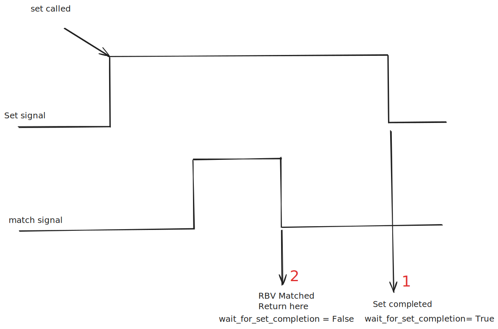

# `set_and_wait_for_other_value`

The `set_and_wait_for_other_value` function (defined in `_signal.py`) is a utility designed to:

1. **Set a signal**.
2. **Wait for another signal to reach a specified value (`match_value`)**.

The behavior of the function depends on the value of the `wait_for_set_completion` parameter:  

- **If `wait_for_set_completion = True`:**  
  The function returns at **1** (see diagram below), which occurs when the "set operation" is complete.  

- **If `wait_for_set_completion = False`:**  
  The function returns at **2**, which occurs when the `match_signal` reaches the `match_value`.

In **AreaDetector**, the `wait_for_set_completion` parameter should generally be set to **`False`**, as the preferred behavior is to return when the `match_signal` achieves the `match_value`.

---

## Behavior Diagram:



---

## Example Usage

```python
# Example code snippet for using set_and_wait_for_other_value in an AreaDetector driver
self._arm_status = set_and_wait_for_other_value(
    self._drv.arm,
    1,
    self._drv.state,
    "ready",
    timeout=DEFAULT_TIMEOUT,
    wait_for_set_completion=False,
)
```

In this **AreaDetector driver**, the function ensures that the detector's `arm_status` reaches `"ready"` before capturing data. To achieve this:  

- The detector is instructed to transition to the "armed" state by setting the driver's `arm` signal to `1`.  
- The function waits until the driver's `state` signal equals `"ready"`.  

This approach ensures that data capture is only initiated once the detector is fully prepared.
